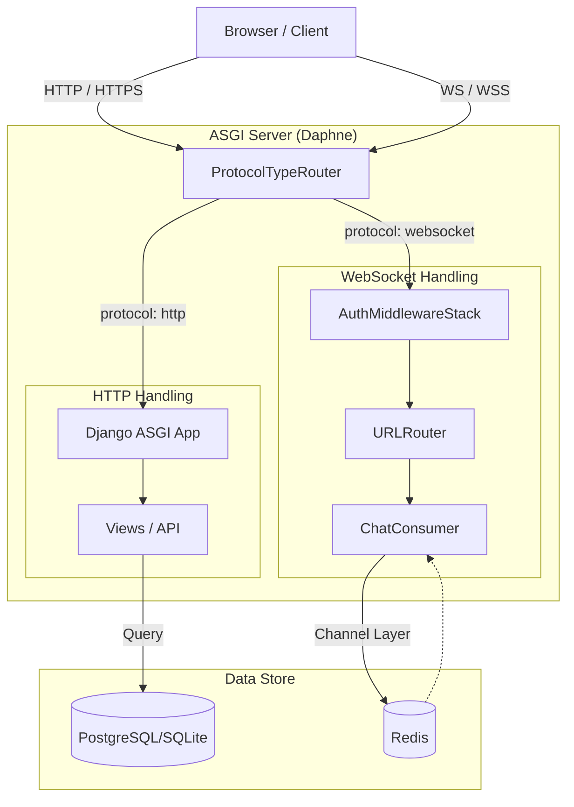

# eLearning Platform - Project Overview

## 1. Project Summary
This is a full-featured **e-learning platform** built with **Django**. It supports **role-based access** (Students vs. Teachers), allowing teachers to manage courses and students to enroll and learn. A standout feature is the **real-time global chat** implemented using **WebSockets (Django Channels)**.

## 2. Technology Stack

| Component | Technology | Version | Purpose |
|-----------|------------|---------|---------|
| **Backend** | Python, Django | 5.1.5 | Core web framework |
| **API** | Django REST Framework | 3.15.2 | RESTful API endpoints |
| **Real-time** | Django Channels, Redis | 4.2.0 | WebSockets for chat |
| **Frontend** | HTML, Bootstrap 5 | 5.3.0 | UI and Styling |
| **Database** | SQLite (Dev) / PostgreSQL | - | Data storage |
| **Server** | Daphne | - | ASGI server for WebSockets |

## 3. Architecture & Flow



## 4. Database Schema (Key Models)

### Users (`users` app)
- **CustomUser**: Extends `AbstractUser`.
    - `role`: 'Student' or 'Teacher'
    - `profile_picture`: ImageField
    - `status`: Text status message

### Courses (`courses` app)
- **Course**: Title, description, teacher (FK).
- **Enrollment**: Links `Student` <-> `Course`.
- **CourseMaterial**: Files uploaded by teachers for a course.
- **Feedback**: Ratings (1-5) and comments from students.
- **CourseBlock**: Teacher can block specific students.
- **Notification**: System notifications for events (enrollment, feedback).

## 5. Key Features & Implementation

### A. Role-Based Access Control (RBAC)
- **Logic**: Custom decorators and checks (`user.role == 'Teacher'`) control access.
- **Teachers**: Create courses, upload materials, block students.
- **Students**: Browse, enroll, rate courses.

### B. Real-Time Chat
- **Tech**: Django Channels + Redis.
- **Flow**:
    1. Client connects to `ws://.../chat/room_name/`.
    2. `ChatConsumer` adds user to a Redis group.
    3. Messages are broadcast to the group and pushed to all connected clients instantly.

### C. Notifications
- **Trigger**: Django Signals (`post_save`).
    - *Example*: When `Enrollment` is created -> Signal triggers -> `Notification` created for Teacher.
- **UI**: Context processor checks for unread notifications and updates the bell icon in the navbar.

### D. REST API
- **Endpoints**:
    - `/api/users/`: User management
    - `/api/courses/`: Course CRUD
    - `/api/enrollments/`: Manage enrollments
    - `/api/feedback/`: Submit/view feedback
- **Auth**: Requires authentication (Session or Token).

## 6. Project Structure
```
elearning/
├── elearning/          # Project settings, URL routing, ASGI config
├── users/              # Auth, profiles, custom user model
├── courses/            # Course logic, enrollments, materials
├── chat/               # WebSocket consumers, routing
├── templates/          # Global HTML templates (base.html)
└── static/             # CSS, JS, Images
```

## 7. Interview Talking Points
- **Why Django Channels?**: "I needed real-time capabilities for the chat feature, and Channels integrates seamlessly with Django's auth system compared to a separate Node.js service."
- **Why Custom User Model?**: "To easily distinguish between Students and Teachers and store profile-specific data like avatars directly on the user object."
- **Handling Static Files**: "Used WhiteNoise for efficient serving of static files in production environments."
- **Scalability**: "The app is container-ready and uses Redis, allowing it to scale horizontally if needed."
